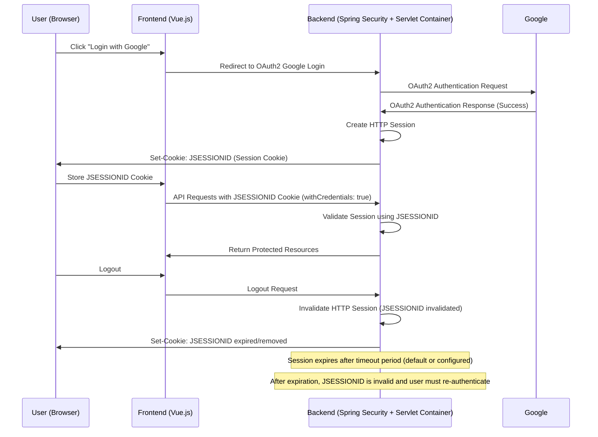

# JSESSIONID Lifecycle Flow in Money Management Application

This diagram visualizes the flow of generating, using, and expiring the JSESSIONID session cookie in the application.

## Explanation

- **JSESSIONID Generation:** When the user successfully logs in via OAuth2 (Google login), Spring Security creates an HTTP session. The servlet container generates the JSESSIONID cookie and sends it to the client.
- **Using JSESSIONID:** The frontend sends the JSESSIONID cookie with every API request (enabled by `withCredentials: true` in axios). The backend uses this cookie to identify and validate the user's session.
- **JSESSIONID Expiration:** The session (and thus JSESSIONID) expires after a configured timeout or when the user logs out. After expiration, the session is invalidated, and the user must log in again to get a new JSESSIONID.

This flow ensures secure session-based authentication without requiring an Authorization header on every request.
